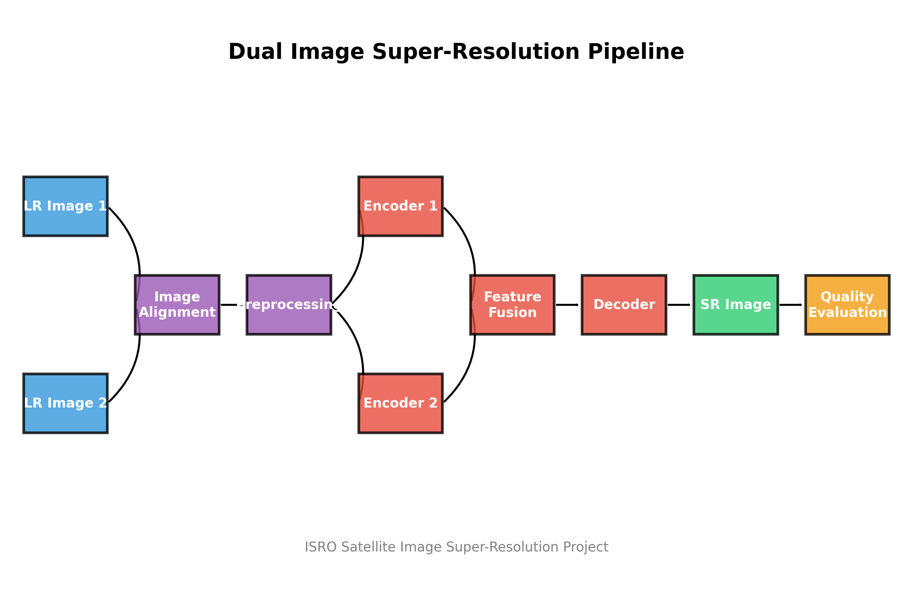

# Dual Image Super-Resolution for Satellite Imagery

A comprehensive project for super-resolution of satellite images using a hybrid classical + GAN pipeline with blind quality evaluation.



## 📋 Project Overview

This project enhances the resolution and quality of satellite imagery by using multiple low-resolution observations of the same area. By leveraging spatial correlations between images and combining classical computer vision techniques with deep learning, we produce higher-resolution outputs with improved detail and clarity.

### Key Features

- **Dual-Image Processing**: Combines information from two low-resolution satellite images
- **Sub-pixel Registration**: Precise alignment of input images using ECC and phase correlation
- **GAN-based Super-Resolution**: Deep learning model for high-quality upscaling
- **Blind Quality Assessment**: No-reference metrics (NIQE, BRISQUE) for quality evaluation
- **Web Interface**: User-friendly Streamlit app for interactive processing
- **Comprehensive Pipeline**: End-to-end solution from preprocessing to evaluation

## 🚀 Getting Started

### Installation

1. Clone the repository:
```bash
git clone https://github.com/your-username/isro-sr-project.git
cd isro-sr-project
```

2. Install dependencies:
```bash
pip install -r requirements.txt
```

3. Install the package in development mode:
```bash
pip install -e .
```

### Using the Web Application

The project includes a Streamlit web application for easy use:

```bash
# On Windows
run_app.bat

# OR using Python
python app/run_app.py
```

The app will be available at http://localhost:8502 in your web browser.

### Training a Model

To train a custom model:

```bash
python scripts/train.py --config config.yaml
```

## 📱 Web Application

The Streamlit web app provides a user-friendly interface for:

1. **Uploading Images**: Upload two low-resolution satellite images
2. **Preprocessing**: Automatic alignment and registration of images
3. **Super-Resolution**: Generate high-resolution output using the dual-encoder GAN
4. **Quality Evaluation**: Compute and display blind quality metrics
5. **Results Download**: Download the enhanced image and quality report

### Using the App

1. Upload two low-resolution satellite images using the file upload widgets
2. The app will automatically align and preprocess the images
3. Click "Generate Super-Resolution Image" to process the images
4. View the results in the "Results & Evaluation" tab
5. Download the super-resolution image and quality report

## 🧠 Model Architecture

The project uses a dual-encoder GAN model that combines traditional computer vision techniques with deep learning:

- **Dual Encoder**: Processes two aligned low-resolution images to extract complementary features
- **Attention Fusion**: Combines features from both images with attention mechanisms
- **GAN Architecture**: Uses a generator-discriminator setup for realistic outputs
- **Perceptual Loss**: Incorporates VGG-based perceptual loss for better visual quality

### Technical Details

- **Generator**: Dual-encoder U-Net with residual blocks and attention mechanisms
- **Discriminator**: PatchGAN discriminator for evaluating local and global image quality
- **Training**: Adversarial training with perceptual and L1 loss components
- **Upscaling**: Supports 2x and 4x upscaling factors

## 🔧 Optimizations for Maximum Accuracy

The model includes several optimizations to achieve high accuracy:

### Architecture Enhancements
- Multi-head attention for better feature relationships
- Multi-scale processing with dilated convolutions
- Progressive upsampling for better quality

### Advanced Training Strategies
- Multi-component loss function (L1, MSE, SSIM, Perceptual, Edge, Spectral)
- Ensemble training with model averaging
- Test-time augmentation

### Enhanced Preprocessing
- Sub-pixel registration with quadratic interpolation
- Advanced quality assessment with multi-factor quality masks
- Cloud and motion blur detection
- Noise assessment and edge consistency checking

## 📁 Repository Structure

```
.
├── app/                # Streamlit web application
│   ├── app.py          # Main Streamlit app
│   ├── flowchart.png   # Process flowchart
│   ├── run_app.py      # App runner script
│   └── assets/         # Static assets
├── data/               # Data directory
│   └── raw/            # Raw satellite images
├── docs/               # Documentation
│   └── ACCURACY_OPTIMIZATIONS.md  # Detailed optimization docs
├── isro_sr/            # Main package
│   ├── data/           # Data handling modules
│   ├── models/         # ML model implementations
│   └── utils/          # Utility functions
├── models/             # Saved model weights
├── scripts/            # Training and evaluation scripts
├── config.yaml         # Configuration file
├── requirements.txt    # Python dependencies
├── run_app.bat         # Windows batch file to run the app
└── setup.py            # Package setup file
```

## 🔍 Advanced Usage

### Custom Configuration

Edit `config.yaml` to customize:
- Model architecture parameters
- Training hyperparameters
- Data augmentation settings
- Evaluation metrics

### Hardware Requirements

- **Memory**: Minimum 8GB GPU memory recommended for training
- **Disk Space**: ~50GB for checkpoints and logs
- **Processing**: Multi-core CPU recommended for preprocessing

## 👥 Credits and License

Developed by the ISRO Satellite Image Super-Resolution Team.

© 2023 ISRO - All Rights Reserved 
